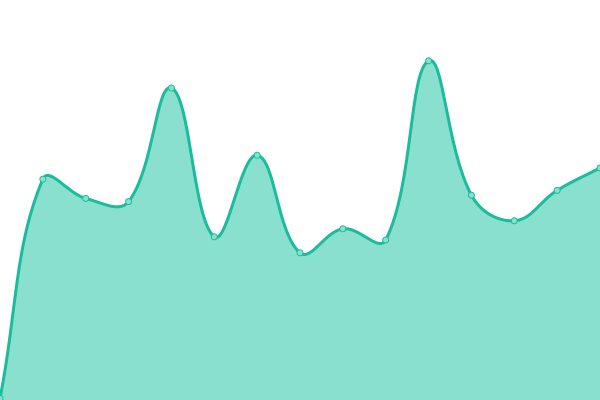

# [📈 Live Status](https://demo.upptime.js.org): <!--live status--> **🟧 Partial outage**

This repository contains the open-source uptime monitor and status page for [Upptime](https://upptime.js.org), powered by [Upptime](https://github.com/upptime/upptime).

With [Upptime](https://upptime.js.org), you can get your own unlimited and free uptime monitor and status page, powered entirely by a GitHub repository. We use [Issues](https://github.com/upptime/upptime/issues) as incident reports, [Actions](https://github.com/flow6dmrv2/flow6dmrv2/upptime/actions) as uptime monitors, and [Pages](https://demo.upptime.js.org) for the status page.

<!--start: status pages-->
<!-- This summary is generated by Upptime (https://github.com/upptime/upptime) -->
<!-- Do not edit this manually, your changes will be overwritten -->
<!-- prettier-ignore -->
| URL | Status | History | Response Time | Uptime |
| --- | ------ | ------- | ------------- | ------ |
|  [Google](https://www.google.com) | 🟩 Up | [google.yml](https://github.com/flow6dmrv2/upptime/commits/HEAD/history/google.yml) | 

 106ms
     
 | 

<a href="https://flow6dmrv2.github.io/upptime/history/google">100.00%</a>
    

|  [AppliCAD](https://www.applicadthai.com/) | 🟥 Down | [appli-cad.yml](https://github.com/flow6dmrv2/upptime/commits/HEAD/history/appli-cad.yml) | 

 119ms
     
 | 

<a href="https://flow6dmrv2.github.io/upptime/history/appli-cad">0.00%</a>
    

|  [Crm AppliCAD](https://crm.appintesys.co/m.php) | 🟩 Up | [crm-appli-cad.yml](https://github.com/flow6dmrv2/upptime/commits/HEAD/history/crm-appli-cad.yml) | 

 911ms
     
 | 

<a href="https://flow6dmrv2.github.io/upptime/history/crm-appli-cad">100.00%</a>
    

|  [AppliCAD Indonesia](https://www.applicadindonesia.com) | 🟩 Up | [appli-cad-indonesia.yml](https://github.com/flow6dmrv2/upptime/commits/HEAD/history/appli-cad-indonesia.yml) | 

 116ms
     
 | 

<a href="https://flow6dmrv2.github.io/upptime/history/appli-cad-indonesia">100.00%</a>
    

|  [8Baht](https://8baht.com) | 🟥 Down | [8-baht.yml](https://github.com/flow6dmrv2/upptime/commits/HEAD/history/8-baht.yml) | 

 100ms
     
 | 

<a href="https://flow6dmrv2.github.io/upptime/history/8-baht">0.00%</a>
    

|  [Deti](https://deti.co.th) | 🟩 Up | [deti.yml](https://github.com/flow6dmrv2/upptime/commits/HEAD/history/deti.yml) | 

 339ms
     
 | 

<a href="https://flow6dmrv2.github.io/upptime/history/deti">100.00%</a>
    

|  [AppliCAD](applicadthai.com) | 🟥 Down | [appli-cad.yml](https://github.com/flow6dmrv2/upptime/commits/HEAD/history/appli-cad.yml) | 

 119ms
     
 | 

<a href="https://flow6dmrv2.github.io/upptime/history/appli-cad">0.00%</a>
    

|  [ThaiGstarCAD](https://thaigstarcad.com) | 🟩 Up | [thai-gstar-cad.yml](https://github.com/flow6dmrv2/upptime/commits/HEAD/history/thai-gstar-cad.yml) | 

 1215ms
     
 | 

<a href="https://flow6dmrv2.github.io/upptime/history/thai-gstar-cad">99.83%</a>
    

<!--end: status pages-->

[**Visit our status website →**](https://demo.upptime.js.org)

## 📄 License

- Powered by: [Upptime](https://github.com/upptime/upptime)
- Code: [MIT](./LICENSE) © [Anand Chowdhary](https://anandchowdhary.com), supported by [Pabio](https://pabio.com)
- Data in the `./history` directory: [Open Database License](https://opendatacommons.org/licenses/odbl/1-0/)
